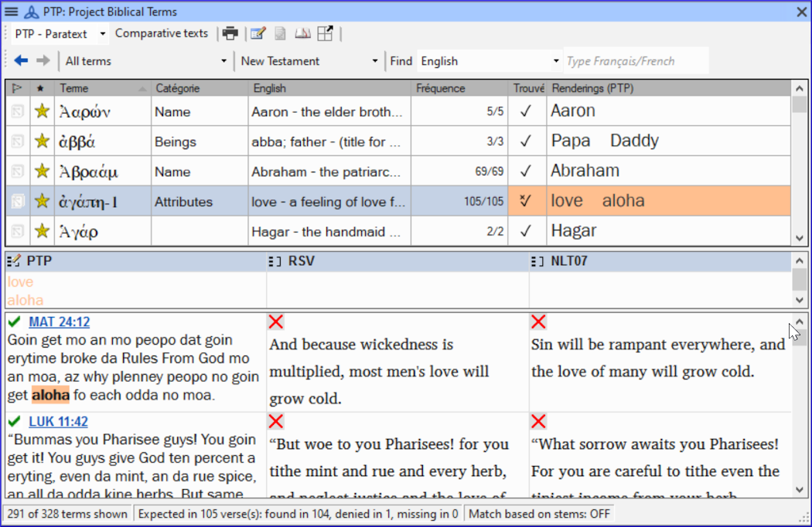
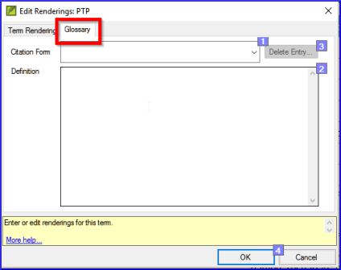

**Introduction**  
This module explains how to add entries to the glossary using the **Biblical terms** tool.

**Before you start**  
You have drafted and entered your text in Paratext 9. Now you will add some glossary entries to explain some of the terms.

**Why this is important**  
It is good to have a list of important words and their explanations so that the readers can understand the text well. Rather than typing directly into the glossary, it is better to use the **Biblical terms** tool as it keeps the Glossary in alphabetical order. The tool also keeps track of the changes to the glossary.

**What you are going to do**  
You will use the Biblical terms tool to add a rendering for the term and then use the glossary tab to enter the citation form and the definition.

There are four training videos available on [adding] (../../Video-summaries/02-Stage-1/5.Additional/1A.4a.md), [linking] (../../Video-summaries/02-Stage-1/5.Additional/1A.4c.md) and [editing] (../../Video-summaries/02-Stage-1/5.Additional/1A.4d.md) and getting [permission to edit] (../../Video-summaries/02-Stage-1/5.Additional/1A.4b.md) glossaries. (P9 1A.4a-d).
:::note 
These videos have not been upgraded for Paratext 9.3. Although the steps are very similar, version 9.3 has improved editing the citation form and ordering the entries. So you don't need to use the workarounds for editing the citation form or ordering the entries from the GLO book.
:::

## 9.1 Open the Biblical Terms tool
1.  Within Paratext, move to a verse which contains the term you want to add to the glossary.
1.  Right-click and choose **View Biblical Terms**, then **Current Verse(s)**
1.  Check that you have the correct list open (e.g. your project list or the NT Key Biblical Terms [SIL])  
  
1.  To change the list, from the **≡ Tab**, under **Biblical terms** menu choose **Select biblical terms list**

## 9.2 Add an entry
1.  Double-click on the term in the list in the top pane
1.  Click the **Glossary** tab  
    
1.  Type the citation form of the term (i.e. the way you want it in the glossary) [1]
1.  Type the Definition [2]
1.  Click **OK**  
    -  *The word(s) and the definition will be added to the glossary in alphabetical order.*

## 9.3 Link an existing entry
:::tip
If the word is already in the glossary, you can link a biblical term to the existing entry in the glossary. Later in stage 6 you will link the biblical term to the text to add the \* in the printed text or the link in the electronic app.
:::
### Find the Biblical term
1.  From the **Biblical Terms** tool
1.  Check that you have the correct list open (e.g. your project list or the NT Key Biblical Terms [SIL])
1.  Double-click on the word in the list in the top pane

### Link to glossary entry
1.  Click the **Glossary** tab
3.  Click the down arrow near the citation form [1]
4.  Choose the entry from the glossary
5.  Click **OK**

## 9.4 View the glossary
In Paratext

1.  Use the navigation bar to change the book  
    
1.  Choose the **GLO** book

## 9.5 Edit an entry – in the GLO book
In Paratext
:::tip
It is recommended to use the Biblical Terms tool to work on glossary entries. However, it can be useful to edit the definitions from the GLO book.
:::

1.  Open the **GLO** book
1.  Edit the text as normal.

## 9.6 Edit an entry – in the Biblical Terms
1.  **≡ Tab**, under **Tools** \> **Biblical terms…**
1.  Double-click on the word in the list in the top pane.
1.  Click the **Glossary** tab
1.  Edit the definition
1.  Click **OK**.

:::tip Paratext 9.3
You can now edit the citation form in this tab without breaking the link to the entry.
:::
## 9.7 Add a Biblical Term
-  see the section [**10.7 Add a term – from reference text search**](BT#107-add-a-term--from-reference-text-search)

## 9.8 Recall
-  You open the Biblical Terms tool from the \_______\_ menu.
-  The **Glossary** tab is on the \__\__\_ dialogue. To open this dialogue you \_\_\_-click on the term in the \_\_\_\_ pane.
-  To view the glossary, you change to the \____\_ book (after Revelation).

:::info
[Answers: right-click, Edit Rendering, double, top, GLO]
:::